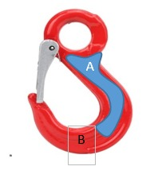
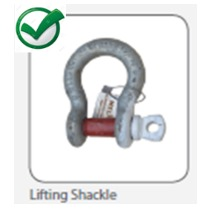
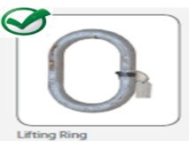
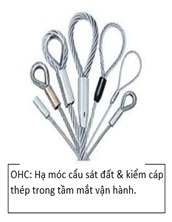

<html>
<head>
	
	<meta http-equiv="content-type" content="text/html; charset=iso-8859-1"/>
	<title></title>
	<meta name="generator" content="LibreOffice 5.4.7.2 (Linux)"/>
	<meta name="author" content="Van Phuoc Son Nguyen"/>
	<meta name="created" content="2020-10-24T07:26:48"/>
	<meta name="changedby" content="Van Phuoc Son Nguyen"/>
	<meta name="changed" content="2020-10-27T07:25:09"/>
	<meta name="AppVersion" content="16.0300"/>
	<meta name="Company" content="First Solar Inc."/>
	<meta name="DocSecurity" content="0"/>
	<meta name="HyperlinksChanged" content="false"/>
	<meta name="LinksUpToDate" content="false"/>
	<meta name="MSIP_Label_045e5c33-258d-427f-92b5-5b45823b5d64_ActionId" content="9ffa8bfe-bae1-49ba-bca7-d99c374d4fdc"/>
	<meta name="MSIP_Label_045e5c33-258d-427f-92b5-5b45823b5d64_Application" content="Microsoft Azure Information Protection"/>
	<meta name="MSIP_Label_045e5c33-258d-427f-92b5-5b45823b5d64_Enabled" content="True"/>
	<meta name="MSIP_Label_045e5c33-258d-427f-92b5-5b45823b5d64_Extended_MSFT_Method" content="Automatic"/>
	<meta name="MSIP_Label_045e5c33-258d-427f-92b5-5b45823b5d64_Name" content="General"/>
	<meta name="MSIP_Label_045e5c33-258d-427f-92b5-5b45823b5d64_Owner" content="FS121231@firstsolar.com"/>
	<meta name="MSIP_Label_045e5c33-258d-427f-92b5-5b45823b5d64_Parent" content="e4245a9f-2f1b-4630-96f9-19af6cc95c1b"/>
	<meta name="MSIP_Label_045e5c33-258d-427f-92b5-5b45823b5d64_SetDate" content="2020-10-24T07:32:59.8750908Z"/>
	<meta name="MSIP_Label_045e5c33-258d-427f-92b5-5b45823b5d64_SiteId" content="f9914f5c-6fc2-4043-9c04-6ccec0b819f5"/>
	<meta name="MSIP_Label_e4245a9f-2f1b-4630-96f9-19af6cc95c1b_ActionId" content="9ffa8bfe-bae1-49ba-bca7-d99c374d4fdc"/>
	<meta name="MSIP_Label_e4245a9f-2f1b-4630-96f9-19af6cc95c1b_Application" content="Microsoft Azure Information Protection"/>
	<meta name="MSIP_Label_e4245a9f-2f1b-4630-96f9-19af6cc95c1b_Enabled" content="True"/>
	<meta name="MSIP_Label_e4245a9f-2f1b-4630-96f9-19af6cc95c1b_Extended_MSFT_Method" content="Automatic"/>
	<meta name="MSIP_Label_e4245a9f-2f1b-4630-96f9-19af6cc95c1b_Name" content="First Solar Proprietary and Confidential"/>
	<meta name="MSIP_Label_e4245a9f-2f1b-4630-96f9-19af6cc95c1b_Owner" content="FS121231@firstsolar.com"/>
	<meta name="MSIP_Label_e4245a9f-2f1b-4630-96f9-19af6cc95c1b_SetDate" content="2020-10-24T07:32:59.8750908Z"/>
	<meta name="MSIP_Label_e4245a9f-2f1b-4630-96f9-19af6cc95c1b_SiteId" content="f9914f5c-6fc2-4043-9c04-6ccec0b819f5"/>
	<meta name="ScaleCrop" content="false"/>
	<meta name="Sensitivity" content="First Solar Proprietary and Confidential General"/>
	<meta name="ShareDoc" content="false"/>
	
	
	
</head>

<body>
<table cellspacing="0" border="0">
	<colgroup width="100"></colgroup>
	<colgroup width="400"></colgroup>
	<colgroup width="100"></colgroup>
	<colgroup width="600"></colgroup>
	<tr>
		<td colspan=4 height="20" align="center" valign=middle ><b>Pre use inspection checklist/ Ki&#7875;m Tra Tr&#432;&#7899;c M&#7895;i L&#7847;n S&#7917; D&#7909;ng</b></td>
		<td align="left" valign=bottom> </td>
	</tr>
	<tr>
		<td height="20" align="left" valign=middle colspan = 2><b>NOTE:  {&radic;} = T&#7889;t,   {X} = C&#7847;n kh&#7855;c ph&#7909;c,  {NA} = Kh&ocirc;ng &aacute;p d&#7909;ng. </b></td>
		<td align="left" valign=bottom> </td>
		<td align="left" valign=bottom> </td>
		<td align="left" valign=bottom> </td>
	</tr>
	<tr>
		<td style="border-top: 2px solid #000000; border-bottom: 2px solid #000000; border-left: 2px solid #000000; border-right: 2px solid #000000" colspan=3 height="20" align="center" valign=middle bgcolor="#D9D9D9"><b>Description/ Danh m&#7909;c ki&#7875;m tra tr&#432;&#7899;c s&#7917; d&#7909;ng</b></td>
		<td align="left" valign=bottom> </td>
	</tr>
	<tr>
		<td style="border-top: 2px solid #000000; border-bottom: 2px solid #000000; border-left: 2px solid #000000; border-right: 2px solid #000000" height="20" align="center" valign=middle bgcolor="#D9D9D9"><b>Thi&#7871;t b&#7883;</b></td>
		<td style="border-top: 2px solid #000000; border-bottom: 2px solid #000000; border-left: 2px solid #000000" colspan=2 align="center" valign=middle bgcolor="#D9D9D9"><b>N&#7897;i dung ki&#7875;m tra</b></td>
		<td style="border-top: 2px solid #000000; border-bottom: 2px solid #000000; border-left: 2px solid #000000; border-right: 2px solid #000000" align="left" valign=bottom bgcolor="#D0CECE"> </td>
	</tr>
	<tr>
		<td style="border-top: 2px solid #000000; border-bottom: 2px solid #000000; border-left: 2px solid #000000; border-right: 2px solid #000000" rowspan=5 height="120" align="left" valign=top><i> 
		</i></td>
		<td style="border-top: 2px solid #000000; border-bottom: 2px solid #000000; border-left: 2px solid #000000" colspan=2 align="left" valign=middle>Bi&#7871;n d&#7841;ng c&#7911;a mi&#7879;ng m&oacute;c, khuy&ecirc;n m&oacute;c, s&#7921; u&#7889;n cong v&#7863;n v&#7865;o, b&#7845;t k&#7923; s&#7921; xo&#7855;n n&agrave;o theo tr&#7909;c m&oacute;c.</td>
		<td style="border-top: 2px solid #000000; border-bottom: 2px solid #000000; border-left: 2px solid #000000; border-right: 2px solid #000000" align="left" valign=bottom>
        <input type="radio" id="Good" name="Test" value="Good">
        <label for="Good">{&radic;} = T&#7889;t</label>
        <input type="radio" id="N Good" name="Test" value="N Good">
        <label for="N Good">{X} = C&#7847;n kh&#7855;c ph&#7909;c</label>
        <input type="radio" id="other" name="Test" value="other">
        <label for="other">{NA} = Kh&ocirc;ng &aacute;p d&#7909;ng</label>    </td>
	</tr>
	<tr>
		<td style="border-top: 2px solid #000000; border-bottom: 2px solid #000000; border-left: 2px solid #000000" colspan=2 align="left" valign=middle>V&#7871;t n&#7913;t, v&#7871;t c&#7855;t, kh&iacute;a ho&#7863;c r&atilde;nh</td>
		<td style="border-top: 2px solid #000000; border-bottom: 2px solid #000000; border-left: 2px solid #000000; border-right: 2px solid #000000" align="left" valign=bottom>
        <input type="radio" id="Good" name="Test" value="Good">
        <label for="Good">{&radic;} = T&#7889;t</label>
        <input type="radio" id="N Good" name="Test" value="N Good">
        <label for="N Good">{X} = C&#7847;n kh&#7855;c ph&#7909;c</label>
        <input type="radio" id="other" name="Test" value="other">
        <label for="other">{NA} = Kh&ocirc;ng &aacute;p d&#7909;ng</label></td>
	</tr>
	<tr>
		<td style="border-top: 2px solid #000000; border-bottom: 2px solid #000000; border-left: 2px solid #000000" colspan=2 align="left" valign=middle>Hao m&ograve;n khu v&#7921;c A qu&aacute; 10%, khu v&#7921;c B qu&aacute; 5%</td>
		<td style="border-top: 2px solid #000000; border-bottom: 2px solid #000000; border-left: 2px solid #000000; border-right: 2px solid #000000" align="left" valign=bottom>
        <input type="radio" id="Good" name="Test" value="Good">
        <label for="Good">{&radic;} = T&#7889;t</label>
        <input type="radio" id="N Good" name="Test" value="N Good">
        <label for="N Good">{X} = C&#7847;n kh&#7855;c ph&#7909;c</label>
        <input type="radio" id="other" name="Test" value="other">
        <label for="other">{NA} = Kh&ocirc;ng &aacute;p d&#7909;ng</label>></td>
	</tr>
	<tr>
		<td style="border-top: 2px solid #000000; border-bottom: 2px solid #000000; border-left: 2px solid #000000" colspan=2 align="left" valign=middle>T&igrave;nh tr&#7841;ng l&#7851;y kh&oacute;a an to&agrave;n</td>
		<td style="border-top: 2px solid #000000; border-bottom: 2px solid #000000; border-left: 2px solid #000000; border-right: 2px solid #000000" align="left" valign=bottom>
        <input type="radio" id="Good" name="Test" value="Good">
        <label for="Good">{&radic;} = T&#7889;t</label>
        <input type="radio" id="N Good" name="Test" value="N Good">
        <label for="N Good">{X} = C&#7847;n kh&#7855;c ph&#7909;c</label>
        <input type="radio" id="other" name="Test" value="other">
        <label for="other">{NA} = Kh&ocirc;ng &aacute;p d&#7909;ng</label></td>
	</tr>
	<tr>
		<td style="border-top: 2px solid #000000; border-bottom: 2px solid #000000; border-left: 2px solid #000000" colspan=2 align="left" valign=middle>Kh&ocirc;ng c&oacute;/ kh&ocirc;ng &#273;&#7885;c &#273;&#432;&#7907;c SWL (t&#7843;i tr&#7885;ng an to&agrave;n)/ th&#7901;i h&#7841;n ki&#7875;m &#273;&#7883;nh c&ograve;n hi&#7879;u l&#7921;c.</td>
		<td style="border-top: 2px solid #000000; border-bottom: 2px solid #000000; border-left: 2px solid #000000; border-right: 2px solid #000000" align="left" valign=bottom>
        <input type="radio" id="Good" name="Test" value="Good">
        <label for="Good">{&radic;} = T&#7889;t</label>
        <input type="radio" id="N Good" name="Test" value="N Good">
        <label for="N Good">{X} = C&#7847;n kh&#7855;c ph&#7909;c</label>
        <input type="radio" id="other" name="Test" value="other">
        <label for="other">{NA} = Kh&ocirc;ng &aacute;p d&#7909;ng</label></td>
	</tr>
	<tr>
		<td style="border-top: 2px solid #000000; border-bottom: 2px solid #000000; border-left: 2px solid #000000; border-right: 2px solid #000000" rowspan=5 height="150" align="left" valign=top> 
		</td>
		<td style="border-top: 2px solid #000000; border-bottom: 2px solid #000000; border-left: 2px solid #000000" colspan=2 align="left" valign=middle>V&#7871;t l&otilde;m, v&#7871;t c&#7855;t, r&#7841;n n&#7913;t</td>
		<td style="border-top: 2px solid #000000; border-bottom: 2px solid #000000; border-left: 2px solid #000000; border-right: 2px solid #000000" align="left" valign=bottom>
        <input type="radio" id="Good" name="Test" value="Good">
        <label for="Good">{&radic;} = T&#7889;t</label>
        <input type="radio" id="N Good" name="Test" value="N Good">
        <label for="N Good">{X} = C&#7847;n kh&#7855;c ph&#7909;c</label>
        <input type="radio" id="other" name="Test" value="other">
        <label for="other">{NA} = Kh&ocirc;ng &aacute;p d&#7909;ng</label></td>
	</tr>
	<tr>
		<td style="border-top: 2px solid #000000; border-bottom: 2px solid #000000; border-left: 2px solid #000000" colspan=2 align="left" valign=middle>M&agrave;i m&ograve;n &#7903; l&#432;ng ma n&iacute; v&agrave; ch&#7889;t kh&ocirc;ng qu&aacute; 5%</td>
		<td style="border-top: 2px solid #000000; border-bottom: 2px solid #000000; border-left: 2px solid #000000; border-right: 2px solid #000000" align="left" valign=bottom>
        <input type="radio" id="Good" name="Test" value="Good">
        <label for="Good">{&radic;} = T&#7889;t</label>
        <input type="radio" id="N Good" name="Test" value="N Good">
        <label for="N Good">{X} = C&#7847;n kh&#7855;c ph&#7909;c</label>
        <input type="radio" id="other" name="Test" value="other">
        <label for="other">{NA} = Kh&ocirc;ng &aacute;p d&#7909;ng</label></td>
	</tr>
	<tr>
		<td style="border-top: 2px solid #000000; border-bottom: 2px solid #000000; border-left: 2px solid #000000" colspan=2 align="left" valign=middle>B&#7845;t k&#7923; s&#7921; u&#7889;n cong, v&#7863;n v&#7865;o</td>
		<td style="border-top: 2px solid #000000; border-bottom: 2px solid #000000; border-left: 2px solid #000000; border-right: 2px solid #000000" align="left" valign=bottom>
        <input type="radio" id="Good" name="Test" value="Good">
        <label for="Good">{&radic;} = T&#7889;t</label>
        <input type="radio" id="N Good" name="Test" value="N Good">
        <label for="N Good">{X} = C&#7847;n kh&#7855;c ph&#7909;c</label>
        <input type="radio" id="other" name="Test" value="other">
        <label for="other">{NA} = Kh&ocirc;ng &aacute;p d&#7909;ng</label></td>
	</tr>
	<tr>
		<td style="border-top: 2px solid #000000; border-bottom: 2px solid #000000; border-left: 2px solid #000000" colspan=2 align="left" valign=middle>T&igrave;nh tr&#7841;ng ren c&#7911;a ch&#7889;t v&agrave; l&#7893; c&#7911;a ma n&iacute;</td>
		<td style="border-top: 2px solid #000000; border-bottom: 2px solid #000000; border-left: 2px solid #000000; border-right: 2px solid #000000" align="left" valign=bottom>
        <input type="radio" id="Good" name="Test" value="Good">
        <label for="Good">{&radic;} = T&#7889;t</label>
        <input type="radio" id="N Good" name="Test" value="N Good">
        <label for="N Good">{X} = C&#7847;n kh&#7855;c ph&#7909;c</label>
        <input type="radio" id="other" name="Test" value="other">
        <label for="other">{NA} = Kh&ocirc;ng &aacute;p d&#7909;ng</label></td>
	</tr>
	<tr>
		<td style="border-top: 2px solid #000000; border-bottom: 2px solid #000000; border-left: 2px solid #000000" colspan=2 align="left" valign=middle>Kh&ocirc;ng c&oacute;/ kh&ocirc;ng &#273;&#7885;c &#273;&#432;&#7907;c SWL, th&#7901;i h&#7841;n ki&#7875;m &#273;&#7883;nh.</td>
		<td style="border-top: 2px solid #000000; border-bottom: 2px solid #000000; border-left: 2px solid #000000; border-right: 2px solid #000000" align="left" valign=bottom>
        <input type="radio" id="Good" name="Test" value="Good">
        <label for="Good">{&radic;} = T&#7889;t</label>
        <input type="radio" id="N Good" name="Test" value="N Good">
        <label for="N Good">{X} = C&#7847;n kh&#7855;c ph&#7909;c</label>
        <input type="radio" id="other" name="Test" value="other">
        <label for="other">{NA} = Kh&ocirc;ng &aacute;p d&#7909;ng</label></td>
	</tr>
	<tr>
		<td style="border-top: 2px solid #000000; border-bottom: 2px solid #000000; border-left: 2px solid #000000; border-right: 2px solid #000000" rowspan=4 height="150" align="left" valign=top> 
		</td>
		<td style="border-top: 2px solid #000000; border-bottom: 2px solid #000000; border-left: 2px solid #000000" colspan=2 align="left" valign=middle>Khuy&ecirc;n treo kh&ocirc;ng c&oacute; b&#7845;t k&#7923; v&#7871;t n&#7913;t, v&#7871;t l&otilde;m, v&#7871;t c&#7855;t.</td>
		<td style="border-top: 2px solid #000000; border-bottom: 2px solid #000000; border-left: 2px solid #000000; border-right: 2px solid #000000" align="left" valign=bottom>
        <input type="radio" id="Good" name="Test" value="Good">
        <label for="Good">{&radic;} = T&#7889;t</label>
        <input type="radio" id="N Good" name="Test" value="N Good">
        <label for="N Good">{X} = C&#7847;n kh&#7855;c ph&#7909;c</label>
        <input type="radio" id="other" name="Test" value="other">
        <label for="other">{NA} = Kh&ocirc;ng &aacute;p d&#7909;ng</label></td>
	</tr>
	<tr>
		<td style="border-top: 2px solid #000000; border-bottom: 2px solid #000000; border-left: 2px solid #000000" colspan=2 align="left" valign=middle>B&#7845;t k&#7923; hao m&ograve;n n&agrave;o v&#432;&#7907;t qu&aacute; 5% k&iacute;ch th&#432;&#7899;c ban &#273;&#7847;u</td>
		<td style="border-top: 2px solid #000000; border-bottom: 2px solid #000000; border-left: 2px solid #000000; border-right: 2px solid #000000" align="left" valign=bottom>
        <input type="radio" id="Good" name="Test" value="Good">
        <label for="Good">{&radic;} = T&#7889;t</label>
        <input type="radio" id="N Good" name="Test" value="N Good">
        <label for="N Good">{X} = C&#7847;n kh&#7855;c ph&#7909;c</label>
        <input type="radio" id="other" name="Test" value="other">
        <label for="other">{NA} = Kh&ocirc;ng &aacute;p d&#7909;ng</label></td>
	</tr>
	<tr>
		<td style="border-top: 2px solid #000000; border-bottom: 2px solid #000000; border-left: 2px solid #000000" colspan=2 align="left" valign=middle>Bi&#7871;n d&#7841;ng so v&#7899;i h&igrave;nh d&aacute;ng ban &#273;&#7847;u</td>
		<td style="border-top: 2px solid #000000; border-bottom: 2px solid #000000; border-left: 2px solid #000000; border-right: 2px solid #000000" align="left" valign=bottom>
        <input type="radio" id="Good" name="Test" value="Good">
        <label for="Good">{&radic;} = T&#7889;t</label>
        <input type="radio" id="N Good" name="Test" value="N Good">
        <label for="N Good">{X} = C&#7847;n kh&#7855;c ph&#7909;c</label>
        <input type="radio" id="other" name="Test" value="other">
        <label for="other">{NA} = Kh&ocirc;ng &aacute;p d&#7909;ng</label></td>
	</tr>
	<tr>
		<td style="border-top: 2px solid #000000; border-bottom: 2px solid #000000; border-left: 2px solid #000000" colspan=2 align="left" valign=middle>Th&#7867; treo c&oacute; th&ocirc;ng tin SWL, th&#7901;i h&#7841;n ki&#7875;m &#273;&#7883;nh</td>
		<td style="border-top: 2px solid #000000; border-bottom: 2px solid #000000; border-left: 2px solid #000000; border-right: 2px solid #000000" align="left" valign=bottom>
        <input type="radio" id="Good" name="Test" value="Good">
        <label for="Good">{&radic;} = T&#7889;t</label>
        <input type="radio" id="N Good" name="Test" value="N Good">
        <label for="N Good">{X} = C&#7847;n kh&#7855;c ph&#7909;c</label>
        <input type="radio" id="other" name="Test" value="other">
        <label for="other">{NA} = Kh&ocirc;ng &aacute;p d&#7909;ng</label></td>
	</tr>
	<tr>
		<td style="border-top: 2px solid #000000; border-bottom: 2px solid #000000; border-left: 2px solid #000000; border-right: 2px solid #000000" rowspan=5 height="150" align="left" valign=top> 
		</td>
		<td style="border-top: 2px solid #000000; border-bottom: 2px solid #000000; border-left: 2px solid #000000" colspan=2 align="left" valign=middle>Kh&ocirc;ng c&oacute; b&#7845;t k&#7923; v&#7871;t n&#7913;t, v&#7871;t l&otilde;m, v&#7871;t c&#7855;t n&agrave;o</td>
		<td style="border-top: 2px solid #000000; border-bottom: 2px solid #000000; border-left: 2px solid #000000; border-right: 2px solid #000000" align="left" valign=bottom>
        <input type="radio" id="Good" name="Test" value="Good">
        <label for="Good">{&radic;} = T&#7889;t</label>
        <input type="radio" id="N Good" name="Test" value="N Good">
        <label for="N Good">{X} = C&#7847;n kh&#7855;c ph&#7909;c</label>
        <input type="radio" id="other" name="Test" value="other">
        <label for="other">{NA} = Kh&ocirc;ng &aacute;p d&#7909;ng</label></td>
	</tr>
	<tr>
		<td style="border-top: 2px solid #000000; border-bottom: 2px solid #000000; border-left: 2px solid #000000" colspan=2 align="left" valign=middle>B&#7845;t k&#7923; hao m&ograve;n n&agrave;o v&#432;&#7907;t qu&aacute; 5% k&iacute;ch th&#432;&#7899;c ban &#273;&#7847;u</td>
		<td style="border-top: 2px solid #000000; border-bottom: 2px solid #000000; border-left: 2px solid #000000; border-right: 2px solid #000000" align="left" valign=bottom>
        <input type="radio" id="Good" name="Test" value="Good">
        <label for="Good">{&radic;} = T&#7889;t</label>
        <input type="radio" id="N Good" name="Test" value="N Good">
        <label for="N Good">{X} = C&#7847;n kh&#7855;c ph&#7909;c</label>
        <input type="radio" id="other" name="Test" value="other">
        <label for="other">{NA} = Kh&ocirc;ng &aacute;p d&#7909;ng</label></td>
	</tr>
	<tr>
		<td style="border-top: 2px solid #000000; border-bottom: 2px solid #000000; border-left: 2px solid #000000" colspan=2 align="left" valign=middle>Bi&#7871;n d&#7841;ng so v&#7899;i h&igrave;nh d&aacute;ng ban &#273;&#7847;u</td>
		<td style="border-top: 2px solid #000000; border-bottom: 2px solid #000000; border-left: 2px solid #000000; border-right: 2px solid #000000" align="left" valign=bottom>
        <input type="radio" id="Good" name="Test" value="Good">
        <label for="Good">{&radic;} = T&#7889;t</label>
        <input type="radio" id="N Good" name="Test" value="N Good">
        <label for="N Good">{X} = C&#7847;n kh&#7855;c ph&#7909;c</label>
        <input type="radio" id="other" name="Test" value="other">
        <label for="other">{NA} = Kh&ocirc;ng &aacute;p d&#7909;ng</label></td>
	</tr>
	<tr>
		<td style="border-top: 2px solid #000000; border-bottom: 2px solid #000000; border-left: 2px solid #000000" colspan=2 align="left" valign=middle>T&igrave;nh tr&#7841;ng &#273;&#432;&#7901;ng ren c&#7911;a khuy&ecirc;n treo</td>
		<td style="border-top: 2px solid #000000; border-bottom: 2px solid #000000; border-left: 2px solid #000000; border-right: 2px solid #000000" align="left" valign=bottom>
        <input type="radio" id="Good" name="Test" value="Good">
        <label for="Good">{&radic;} = T&#7889;t</label>
        <input type="radio" id="N Good" name="Test" value="N Good">
        <label for="N Good">{X} = C&#7847;n kh&#7855;c ph&#7909;c</label>
        <input type="radio" id="other" name="Test" value="other">
        <label for="other">{NA} = Kh&ocirc;ng &aacute;p d&#7909;ng</label></td>
	</tr>
	<tr>
		<td style="border-top: 2px solid #000000; border-bottom: 2px solid #000000; border-left: 2px solid #000000" colspan=2 align="left" valign=middle>Th&ocirc;ng tin SWL kh&ocirc;ng c&oacute; ho&#7863;c kh&ocirc;ng &#273;&#7885;c &#273;&#432;&#7907;c</td>
		<td style="border-top: 2px solid #000000; border-bottom: 2px solid #000000; border-left: 2px solid #000000; border-right: 2px solid #000000" align="left" valign=bottom>
        <input type="radio" id="Good" name="Test" value="Good">
        <label for="Good">{&radic;} = T&#7889;t</label>
        <input type="radio" id="N Good" name="Test" value="N Good">
        <label for="N Good">{X} = C&#7847;n kh&#7855;c ph&#7909;c</label>
        <input type="radio" id="other" name="Test" value="other">
        <label for="other">{NA} = Kh&ocirc;ng &aacute;p d&#7909;ng</label></td>
	</tr>
	<tr>
		<td style="border-top: 2px solid #000000; border-bottom: 2px solid #000000; border-left: 2px solid #000000; border-right: 2px solid #000000" rowspan=3 height="150" align="left" valign=top> 
		</td>
		<td style="border-top: 2px solid #000000; border-bottom: 2px solid #000000; border-left: 2px solid #000000" colspan=2 align="left" valign=middle>Th&#7867; treo c&oacute; th&ocirc;ng tin t&#7843;i an to&agrave;n SWL, s&#7889; seri/ID</td>
		<td style="border-top: 2px solid #000000; border-bottom: 2px solid #000000; border-left: 2px solid #000000; border-right: 2px solid #000000" align="left" valign=bottom>
        <input type="radio" id="Good" name="Test" value="Good">
        <label for="Good">{&radic;} = T&#7889;t</label>
        <input type="radio" id="N Good" name="Test" value="N Good">
        <label for="N Good">{X} = C&#7847;n kh&#7855;c ph&#7909;c</label>
        <input type="radio" id="other" name="Test" value="other">
        <label for="other">{NA} = Kh&ocirc;ng &aacute;p d&#7909;ng</label></td>
	</tr>
	<tr>
		<td style="border-top: 2px solid #000000; border-bottom: 2px solid #000000; border-left: 2px solid #000000" colspan=2 align="left" valign=middle>C&#7909;m m&oacute;c: v&#7871;t n&#7913;t, v&#7863;n v&#7865;o, &#259;n m&ograve;n, m&agrave;i m&ograve;n, mi&#7879;ng m&oacute;c b&#7883; m&#7903; r&#7897;ng h&#417;n 15% s&#417; v&#7899;i &#273;&#7897; h&#7903; b&igrave;nh th&#432;&#7901;ng ho&#7863;c b&#7883; xo&#7855;n h&#417;n 10 &#273;&#7897; so v&#7899;i m&#7863;t ph&#7859;ng.</td>
		<td style="border-top: 2px solid #000000; border-bottom: 2px solid #000000; border-left: 2px solid #000000; border-right: 2px solid #000000" align="left" valign=bottom>
        <input type="radio" id="Good" name="Test" value="Good">
        <label for="Good">{&radic;} = T&#7889;t</label>
        <input type="radio" id="N Good" name="Test" value="N Good">
        <label for="N Good">{X} = C&#7847;n kh&#7855;c ph&#7909;c</label>
        <input type="radio" id="other" name="Test" value="other">
        <label for="other">{NA} = Kh&ocirc;ng &aacute;p d&#7909;ng</label></td>
	</tr>
	<tr>
		<td style="border-top: 2px solid #000000; border-bottom: 2px solid #000000; border-left: 2px solid #000000" colspan=2 align="left" valign=middle>X&iacute;ch: s&#7921; m&agrave;i m&ograve;n, n&#7913;t,  m&#7855;t x&iacute;ch cong, h&#432; m&#7889;i h&agrave;n, ki&#7875;m tra t&#7915;ng m&#7855;t x&iacute;ch v&#7873; &#273;&#7897; cong, b&#7883; k&eacute;o c&#259;ng, b&#7883; n&#7913;t ho&#7863;c thi&#7879;t h&#7841;i do nhi&#7879;t</td>
		<td style="border-top: 2px solid #000000; border-bottom: 2px solid #000000; border-left: 2px solid #000000; border-right: 2px solid #000000" align="left" valign=bottom>
        <input type="radio" id="Good" name="Test" value="Good">
        <label for="Good">{&radic;} = T&#7889;t</label>
        <input type="radio" id="N Good" name="Test" value="N Good">
        <label for="N Good">{X} = C&#7847;n kh&#7855;c ph&#7909;c</label>
        <input type="radio" id="other" name="Test" value="other">
        <label for="other">{NA} = Kh&ocirc;ng &aacute;p d&#7909;ng</label></td>
	</tr>
	<tr>
		<td style="border-top: 2px solid #000000; border-bottom: 2px solid #000000; border-left: 2px solid #000000; border-right: 2px solid #000000" rowspan=6 height="150" align="left" valign=middle> 
		</td>
		<td style="border-top: 2px solid #000000; border-bottom: 2px solid #000000; border-left: 2px solid #000000" colspan=2 align="left" valign=middle>S&#7921; nhi&#7877;m b&#7849;n do d&#7847;u m&#7903; kh&ocirc;ng lau &#273;&#432;&#7907;c b&#7857;ng v&#7843;i s&#7841;ch</td>
		<td style="border-top: 2px solid #000000; border-bottom: 2px solid #000000; border-left: 2px solid #000000; border-right: 2px solid #000000" align="left" valign=bottom>
        <input type="radio" id="Good" name="Test" value="Good">
        <label for="Good">{&radic;} = T&#7889;t</label>
        <input type="radio" id="N Good" name="Test" value="N Good">
        <label for="N Good">{X} = C&#7847;n kh&#7855;c ph&#7909;c</label>
        <input type="radio" id="other" name="Test" value="other">
        <label for="other">{NA} = Kh&ocirc;ng &aacute;p d&#7909;ng</label></td>
	</tr>
	<tr>
		<td style="border-top: 2px solid #000000; border-bottom: 2px solid #000000; border-left: 2px solid #000000" colspan=2 align="left" valign=middle>B&#7883; m&ograve;n qu&aacute; gi&#7899;i h&#7841;n ki&#7871;n ngh&#7883; c&#7911;a nh&agrave; s&#7843;n xu&#7845;t</td>
		<td style="border-top: 2px solid #000000; border-bottom: 2px solid #000000; border-left: 2px solid #000000; border-right: 2px solid #000000" align="left" valign=bottom>
        <input type="radio" id="Good" name="Test" value="Good">
        <label for="Good">{&radic;} = T&#7889;t</label>
        <input type="radio" id="N Good" name="Test" value="N Good">
        <label for="N Good">{X} = C&#7847;n kh&#7855;c ph&#7909;c</label>
        <input type="radio" id="other" name="Test" value="other">
        <label for="other">{NA} = Kh&ocirc;ng &aacute;p d&#7909;ng</label></td>
	</tr>
	<tr>
		<td style="border-top: 2px solid #000000; border-bottom: 2px solid #000000; border-left: 2px solid #000000" colspan=2 align="left" valign=middle>&#272;&#432;&#7901;ng ch&#7881; b&#7883; &#273;&#7913;t ho&#7863;c b&#7883; m&ograve;n</td>
		<td style="border-top: 2px solid #000000; border-bottom: 2px solid #000000; border-left: 2px solid #000000; border-right: 2px solid #000000" align="left" valign=bottom>
        <input type="radio" id="Good" name="Test" value="Good">
        <label for="Good">{&radic;} = T&#7889;t</label>
        <input type="radio" id="N Good" name="Test" value="N Good">
        <label for="N Good">{X} = C&#7847;n kh&#7855;c ph&#7909;c</label>
        <input type="radio" id="other" name="Test" value="other">
        <label for="other">{NA} = Kh&ocirc;ng &aacute;p d&#7909;ng</label></td>
	</tr>
	<tr>
		<td style="border-top: 2px solid #000000; border-bottom: 2px solid #000000; border-left: 2px solid #000000" colspan=2 align="left" valign=middle>B&#7883; th&#7911;ng, b&#7883; r&aacute;ch, b&#7883; x&eacute;, b&#7883; c&#7855;t ho&#7863;c b&#7883; b&#7841;c m&agrave;u</td>
		<td style="border-top: 2px solid #000000; border-bottom: 2px solid #000000; border-left: 2px solid #000000; border-right: 2px solid #000000" align="left" valign=bottom>
        <input type="radio" id="Good" name="Test" value="Good">
        <label for="Good">{&radic;} = T&#7889;t</label>
        <input type="radio" id="N Good" name="Test" value="N Good">
        <label for="N Good">{X} = C&#7847;n kh&#7855;c ph&#7909;c</label>
        <input type="radio" id="other" name="Test" value="other">
        <label for="other">{NA} = Kh&ocirc;ng &aacute;p d&#7909;ng</label></td>
	</tr>
	<tr>
		<td style="border-top: 2px solid #000000; border-bottom: 2px solid #000000; border-left: 2px solid #000000" colspan=2 align="left" valign=middle>B&#7883; tan ch&#7843;y ho&#7863;c b&#7883; &#273;&#7889;t th&agrave;nh than c&#7911;a b&#7845;t k&#7923; ph&#7847;n n&agrave;o b&#7873; m&#7863;t d&acirc;y treo, b&#7883; &#273;&#7889;t ch&aacute;y do axit ho&#7863;c ch&#7845;t &#259;n da.</td>
		<td style="border-top: 2px solid #000000; border-bottom: 2px solid #000000; border-left: 2px solid #000000; border-right: 2px solid #000000" align="left" valign=bottom>
        <input type="radio" id="Good" name="Test" value="Good">
        <label for="Good">{&radic;} = T&#7889;t</label>
        <input type="radio" id="N Good" name="Test" value="N Good">
        <label for="N Good">{X} = C&#7847;n kh&#7855;c ph&#7909;c</label>
        <input type="radio" id="other" name="Test" value="other">
        <label for="other">{NA} = Kh&ocirc;ng &aacute;p d&#7909;ng</label></td>
	</tr>
	<tr>
		<td style="border-top: 2px solid #000000; border-bottom: 2px solid #000000; border-left: 2px solid #000000" colspan=2 align="left" valign=middle>kh&ocirc;ng c&oacute; th&ocirc;ng tin SWL ho&#7863;c kh&ocirc;ng &#273;&#7885;c &#273;&#432;&#7907;c</td>
		<td style="border-top: 2px solid #000000; border-bottom: 2px solid #000000; border-left: 2px solid #000000; border-right: 2px solid #000000" align="left" valign=bottom>
        <input type="radio" id="Good" name="Test" value="Good">
        <label for="Good">{&radic;} = T&#7889;t</label>
        <input type="radio" id="N Good" name="Test" value="N Good">
        <label for="N Good">{X} = C&#7847;n kh&#7855;c ph&#7909;c</label>
        <input type="radio" id="other" name="Test" value="other">
        <label for="other">{NA} = Kh&ocirc;ng &aacute;p d&#7909;ng</label></td>
	</tr>
	<tr>
		<td style="border-top: 2px solid #000000; border-bottom: 2px solid #000000; border-left: 2px solid #000000; border-right: 2px solid #000000" rowspan=6 height="150" align="left" valign=middle><u> 
		</u></td>
		<td style="border-top: 2px solid #000000; border-bottom: 2px solid #000000; border-left: 2px solid #000000" colspan=2 align="left" valign=middle>10 s&#7907;i b&#7883; &#273;&#7913;t ng&#7851;u nhi&ecirc;n trong 1 b&#432;&#7899;c c&aacute;p ho&#7863;c 5 s&#7907;i &#273;&#7913;t trong m&#7897;t tao c&aacute;p ho&#7863;c l&#7899;n h&#417;n 3 s&#7907;i li&#7873;n nhau</td>
		<td style="border-top: 2px solid #000000; border-bottom: 2px solid #000000; border-left: 2px solid #000000; border-right: 2px solid #000000" align="left" valign=bottom><input type="radio" id="Good" name="Test" value="Good">
        <label for="Good">{&radic;} = T&#7889;t</label>
        <input type="radio" id="N Good" name="Test" value="N Good">
        <label for="N Good">{X} = C&#7847;n kh&#7855;c ph&#7909;c</label>
        <input type="radio" id="other" name="Test" value="other">
        <label for="other">{NA} = Kh&ocirc;ng &aacute;p d&#7909;ng</label></td>
	</tr>
	<tr>
		<td style="border-top: 2px solid #000000; border-bottom: 2px solid #000000; border-left: 2px solid #000000" colspan=2 align="left" valign=middle>&#258;n m&ograve;n ho&#7863;c &#273;&#7853;p d&#7865;p 1/3 &#273;&#432;&#7901;ng k&iacute;nh g&#7889;c c&#7911;a s&#7907;i ri&ecirc;ng bi&#7879;t b&ecirc;n ngo&agrave;i</td>
		<td style="border-top: 2px solid #000000; border-bottom: 2px solid #000000; border-left: 2px solid #000000; border-right: 2px solid #000000" align="left" valign=bottom>
        <input type="radio" id="Good" name="Test" value="Good">
        <label for="Good">{&radic;} = T&#7889;t</label>
        <input type="radio" id="N Good" name="Test" value="N Good">
        <label for="N Good">{X} = C&#7847;n kh&#7855;c ph&#7909;c</label>
        <input type="radio" id="other" name="Test" value="other">
        <label for="other">{NA} = Kh&ocirc;ng &aacute;p d&#7909;ng</label></td>
	</tr>
	<tr>
		<td style="border-top: 2px solid #000000; border-bottom: 2px solid #000000; border-left: 2px solid #000000" colspan=2 align="left" valign=middle>Th&#7855;t n&uacute;t, nghi&#7871;n, xo&#7855;n t&#7893; chim ho&#7863;c m&#7897;i thi&#7879;t h&#7841;i g&acirc;y ra s&#7921; v&#7863;n v&#7865;o c&#7911;a c&#7845;u tr&uacute;c c&aacute;p</td>
		<td style="border-top: 2px solid #000000; border-bottom: 2px solid #000000; border-left: 2px solid #000000; border-right: 2px solid #000000" align="left" valign=bottom>
        <input type="radio" id="Good" name="Test" value="Good">
        <label for="Good">{&radic;} = T&#7889;t</label>
        <input type="radio" id="N Good" name="Test" value="N Good">
        <label for="N Good">{X} = C&#7847;n kh&#7855;c ph&#7909;c</label>
        <input type="radio" id="other" name="Test" value="other">
        <label for="other">{NA} = Kh&ocirc;ng &aacute;p d&#7909;ng</label></td>
	</tr>
	<tr>
		<td style="border-top: 2px solid #000000; border-bottom: 2px solid #000000; border-left: 2px solid #000000" colspan=2 align="left" valign=middle>D&#7845;u hi&#7879;u thi&#7879;t h&#7841;i/ &#259;n m&ograve;n do nhi&#7879;t/ axit/ ch&#7845;t &#259;n da</td>
		<td style="border-top: 2px solid #000000; border-bottom: 2px solid #000000; border-left: 2px solid #000000; border-right: 2px solid #000000" align="left" valign=bottom>
        <input type="radio" id="Good" name="Test" value="Good">
        <label for="Good">{&radic;} = T&#7889;t</label>
        <input type="radio" id="N Good" name="Test" value="N Good">
        <label for="N Good">{X} = C&#7847;n kh&#7855;c ph&#7909;c</label>
        <input type="radio" id="other" name="Test" value="other">
        <label for="other">{NA} = Kh&ocirc;ng &aacute;p d&#7909;ng</label></td>
	</tr>
	<tr>
		<td style="border-top: 2px solid #000000; border-bottom: 2px solid #000000; border-left: 2px solid #000000" colspan=2 align="left" valign=middle>&#272;&#7847;u bu&#7897;c c&aacute;p b&#7883; n&#7913;t, bi&#7871;n d&#7841;ng ho&#7863;c b&#7883; m&ograve;n</td>
		<td style="border-top: 2px solid #000000; border-bottom: 2px solid #000000; border-left: 2px solid #000000; border-right: 2px solid #000000" align="left" valign=bottom><input type="radio" id="Good" name="Test" value="Good">
        <label for="Good">{&radic;} = T&#7889;t</label>
        <input type="radio" id="N Good" name="Test" value="N Good">
        <label for="N Good">{X} = C&#7847;n kh&#7855;c ph&#7909;c</label>
        <input type="radio" id="other" name="Test" value="other">
        <label for="other">{NA} = Kh&ocirc;ng &aacute;p d&#7909;ng</label></td>
	</tr>
	<tr>
		<td style="border-top: 2px solid #000000; border-bottom: 2px solid #000000; border-left: 2px solid #000000" colspan=2 align="left" valign=middle>Th&#7867; treo c&oacute; th&ocirc;ng tin SWL, ki&#7875;m &#273;&#7883;nh c&ograve;n hi&#7879;u l&#7921;c</td>
		<td style="border-top: 2px solid #000000; border-bottom: 2px solid #000000; border-left: 2px solid #000000; border-right: 2px solid #000000" align="left" valign=bottom>
        <input type="radio" id="Good" name="Test" value="Good">
        <label for="Good">{&radic;} = T&#7889;t</label>
        <input type="radio" id="N Good" name="Test" value="N Good">
        <label for="N Good">{X} = C&#7847;n kh&#7855;c ph&#7909;c</label>
        <input type="radio" id="other" name="Test" value="other">
        <label for="other">{NA} = Kh&ocirc;ng &aacute;p d&#7909;ng</label></td>
	</tr>
	<tr>
		<td style="border-top: 2px solid #000000; border-bottom: 2px solid #000000; border-left: 2px solid #000000; border-right: 2px solid #000000" rowspan=4 height="150" align="left" valign=middle> 
		</td>
		<td style="border-top: 2px solid #000000; border-bottom: 2px solid #000000; border-left: 2px solid #000000" colspan=2 align="left" valign=middle>C&oacute; th&ocirc;ng tin SWL, th&#7901;i h&#7841;n ki&#7875;m &#273;&#7883;nh c&ograve;n hi&#7879;u l&#7921;c</td>
		<td style="border-top: 2px solid #000000; border-bottom: 2px solid #000000; border-left: 2px solid #000000; border-right: 2px solid #000000" align="left" valign=bottom>
        <input type="radio" id="Good" name="Test" value="Good">
        <label for="Good">{&radic;} = T&#7889;t</label>
        <input type="radio" id="N Good" name="Test" value="N Good">
        <label for="N Good">{X} = C&#7847;n kh&#7855;c ph&#7909;c</label>
        <input type="radio" id="other" name="Test" value="other">
        <label for="other">{NA} = Kh&ocirc;ng &aacute;p d&#7909;ng</label></td>
	</tr>
	<tr>
		<td style="border-top: 2px solid #000000; border-bottom: 2px solid #000000; border-left: 2px solid #000000" colspan=2 align="left" valign=middle>Bi&#7871;n d&#7841;ng c&#7911;a d&#7847;m do u&#7889;n cong, v&#7863;n v&#7865;o/ v&#7871;t n&#7913;t</td>
		<td style="border-top: 2px solid #000000; border-bottom: 2px solid #000000; border-left: 2px solid #000000; border-right: 2px solid #000000" align="left" valign=bottom>
        <input type="radio" id="Good" name="Test" value="Good">
        <label for="Good">{&radic;} = T&#7889;t</label>
        <input type="radio" id="N Good" name="Test" value="N Good">
        <label for="N Good">{X} = C&#7847;n kh&#7855;c ph&#7909;c</label>
        <input type="radio" id="other" name="Test" value="other">
        <label for="other">{NA} = Kh&ocirc;ng &aacute;p d&#7909;ng</label></td>
	</tr>
	<tr>
		<td style="border-top: 2px solid #000000; border-bottom: 2px solid #000000; border-left: 2px solid #000000" colspan=2 align="left" valign=middle>M&#7889;i h&agrave;n kh&ocirc;ng b&#7883; r&#7841;n n&#7913;t</td>
		<td style="border-top: 2px solid #000000; border-bottom: 2px solid #000000; border-left: 2px solid #000000; border-right: 2px solid #000000" align="left" valign=bottom>
        <input type="radio" id="Good" name="Test" value="Good">
        <label for="Good">{&radic;} = T&#7889;t</label>
        <input type="radio" id="N Good" name="Test" value="N Good">
        <label for="N Good">{X} = C&#7847;n kh&#7855;c ph&#7909;c</label>
        <input type="radio" id="other" name="Test" value="other">
        <label for="other">{NA} = Kh&ocirc;ng &aacute;p d&#7909;ng</label></td>
	</tr>
	<tr>
		<td style="border-top: 2px solid #000000; border-bottom: 2px solid #000000; border-left: 2px solid #000000" colspan=2 align="left" valign=middle>Ch&#7889;t &#273;i&#7873;u ch&#7881;nh chi&#7873;u r&#7897;ng d&#7847;m n&acirc;ng v&agrave; kh&oacute;a ch&#7889;t</td>
		<td style="border-top: 2px solid #000000; border-bottom: 2px solid #000000; border-left: 2px solid #000000; border-right: 2px solid #000000" align="left" valign=bottom>
        <input type="radio" id="Good" name="Test" value="Good">
        <label for="Good">{&radic;} = T&#7889;t</label>
        <input type="radio" id="N Good" name="Test" value="N Good">
        <label for="N Good">{X} = C&#7847;n kh&#7855;c ph&#7909;c</label>
        <input type="radio" id="other" name="Test" value="other">
        <label for="other">{NA} = Kh&ocirc;ng &aacute;p d&#7909;ng</label></td>
	</tr>
	<tr>
		<td style="border-top: 2px solid #000000; border-bottom: 2px solid #000000; border-left: 2px solid #000000; border-right: 2px solid #000000" height="41" align="left" valign=middle>B&#7897; &#273;i&#7873;u khi&#7875;n</td>
		<td style="border-top: 2px solid #000000; border-bottom: 2px solid #000000; border-left: 2px solid #000000" colspan=2 align="left" valign=middle>V&#7853;n h&agrave;nh th&#7917; &#273;&#7875; ki&#7875;m tra c&#7849;u c&aacute;c thi&#7871;t b&#7883; n&acirc;ng v&#7853;n h&agrave;nh t&#7889;t, test c&ocirc;ng t&#259;c gi&#7899;i h&#7841;n h&agrave;nh tr&igrave;nh tr&ecirc;n</td>
		<td style="border-top: 2px solid #000000; border-bottom: 2px solid #000000; border-left: 2px solid #000000; border-right: 2px solid #000000" align="left" valign=bottom>
        <input type="radio" id="Good" name="Test" value="Good">
        <label for="Good">{&radic;} = T&#7889;t</label>
        <input type="radio" id="N Good" name="Test" value="N Good">
        <label for="N Good">{X} = C&#7847;n kh&#7855;c ph&#7909;c</label>
        <input type="radio" id="other" name="Test" value="other">
        <label for="other">{NA} = Kh&ocirc;ng &aacute;p d&#7909;ng</label></td>
	</tr>
	<tr>
		<td style="border-top: 2px solid #000000; border-bottom: 2px solid #000000; border-left: 2px solid #000000; border-right: 2px solid #000000" height="41" align="left" valign=middle>S&#7921; r&ograve; r&#7881; d&#7847;u.</td>
		<td style="border-top: 2px solid #000000; border-bottom: 2px solid #000000; border-left: 2px solid #000000" colspan=2 align="left" valign=middle>S&#7921; r&ograve; d&#7847;u nh&#7899;t tr&ecirc;n c&#7849;u v&agrave; tr&ecirc;n m&#7863;t &#273;&#7845;t ph&iacute;a d&#432;&#7899;i c&#7849;u.</td>
		<td style="border-top: 2px solid #000000; border-bottom: 2px solid #000000; border-left: 2px solid #000000; border-right: 2px solid #000000" align="left" valign=bottom>
        <input type="radio" id="Good" name="Test" value="Good">
        <label for="Good">{&radic;} = T&#7889;t</label>
        <input type="radio" id="N Good" name="Test" value="N Good">
        <label for="N Good">{X} = C&#7847;n kh&#7855;c ph&#7909;c</label>
        <input type="radio" id="other" name="Test" value="other">
        <label for="other">{NA} = Kh&ocirc;ng &aacute;p d&#7909;ng</label></td>
	</tr>
	<tr>
		<td style="border-top: 2px solid #000000; border-bottom: 2px solid #000000; border-left: 2px solid #000000; border-right: 2px solid #000000" height="41" align="left" valign=middle>&Acirc;m thanh b&#7845;t th&#432;&#7901;ng.</td>
		<td style="border-top: 2px solid #000000; border-bottom: 2px solid #000000; border-left: 2px solid #000000" colspan=2 align="left" valign=middle>Ki&#7875;m tra c&oacute; &acirc;m thanh b&#7845;t th&#432;&#7901;ng t&#7915; c&#7849;u v&agrave; c&aacute;c thi&#7871;t b&#7883; n&acirc;ng trong l&uacute;c ho&#7841;t &#273;&#7897;ng.</td>
		<td style="border-top: 2px solid #000000; border-bottom: 2px solid #000000; border-left: 2px solid #000000; border-right: 2px solid #000000" align="left" valign=bottom>
        <input type="radio" id="Good" name="Test" value="Good">
        <label for="Good">{&radic;} = T&#7889;t</label>
        <input type="radio" id="N Good" name="Test" value="N Good">
        <label for="N Good">{X} = C&#7847;n kh&#7855;c ph&#7909;c</label>
        <input type="radio" id="other" name="Test" value="other">
        <label for="other">{NA} = Kh&ocirc;ng &aacute;p d&#7909;ng</label></td>
	</tr>
	<tr>
		<td style="border-top: 2px solid #000000; border-bottom: 2px solid #000000; border-left: 2px solid #000000; border-right: 2px solid #000000" height="41" align="left" valign=middle>Th&#7867; nh&#7853;n di&#7879;n</td>
		<td style="border-top: 2px solid #000000; border-bottom: 2px solid #000000; border-left: 2px solid #000000" colspan=2 align="left" valign=middle>Th&#7867; treo c&oacute; th&ocirc;ng tin t&#7843;i tr&#7885;ng t&#7889;i &#273;a (SWL), th&#7901;i h&#7841;n ki&#7875;m &#273;&#7883;nh c&ograve;n hi&#7879;u l&#7921;c.</td>
		<td style="border-top: 2px solid #000000; border-bottom: 2px solid #000000; border-left: 2px solid #000000; border-right: 2px solid #000000" align="left" valign=bottom>
        <input type="radio" id="Good" name="Test" value="Good">
        <label for="Good">{&radic;} = T&#7889;t</label>
        <input type="radio" id="N Good" name="Test" value="N Good">
        <label for="N Good">{X} = C&#7847;n kh&#7855;c ph&#7909;c</label>
        <input type="radio" id="other" name="Test" value="other">
        <label for="other">{NA} = Kh&ocirc;ng &aacute;p d&#7909;ng</label></td>
	</tr>
	<tr>
		<td style="border-top: 2px solid #000000; border-bottom: 2px solid #000000; border-left: 2px solid #000000; border-right: 2px solid #000000" height="41" align="left" valign=middle>V&#7879; sinh chung</td>
		<td style="border-top: 2px solid #000000; border-bottom: 2px solid #000000; border-left: 2px solid #000000" colspan=2 align="left" valign=middle>Ki&#7875;m tra khu v&#7921;c n&acirc;ng h&#7841; t&#7843;i c&oacute; c&aacute;c v&#7853;t li&#7879;u va v&#7845;p.</td>
		<td style="border-top: 2px solid #000000; border-bottom: 2px solid #000000; border-left: 2px solid #000000; border-right: 2px solid #000000" align="left" valign=bottom>
        <input type="radio" id="Good" name="Test" value="Good">
        <label for="Good">{&radic;} = T&#7889;t</label>
        <input type="radio" id="N Good" name="Test" value="N Good">
        <label for="N Good">{X} = C&#7847;n kh&#7855;c ph&#7909;c</label>
        <input type="radio" id="other" name="Test" value="other">
        <label for="other">{NA} = Kh&ocirc;ng &aacute;p d&#7909;ng</label></td>
	</tr>
	<tr>
		<td style="border-left: 1px hidden #000000; border-right: 1px hidden #000000" colspan=3 rowspan=2 height="38" align="center" valign=middle><b>Ng&#432;&#7901;i s&#7917; d&#7909;ng ti&#7871;n h&agrave;nh ki&#7875;m tra k&yacute; ghi r&otilde; h&#7885; t&ecirc;n c&#7911;a m&igrave;nh b&ecirc;n d&#432;&#7899;i m&#7895;i c&#7897;t</b></td>
		<td align="left" valign=bottom> </td>
	</tr>
	<tr>
		<td align="left" valign=bottom> </td>
	</tr>
	<tr>
		<td style="border-top: 1px solid #000000; border-bottom: 1px solid #000000; border-left: 1px solid #000000; border-right: 1px solid #000000" height="19" align="left" valign=middle contenteditable='true'>Nh&agrave; m&aacute;y:  DMT1 </td>
		<td style="border-top: 1px solid #000000; border-bottom: 1px solid #000000; border-left: 1px solid #000000; border-right: 1px solid #000000" align="left" valign=middle contenteditable='true'>T&ecirc;n thi&#7871;t b&#7883;:&hellip;&hellip;&hellip;&hellip;&hellip;&hellip;&hellip;&hellip;.<input type="text" ></td>
		<td style="border-top: 1px solid #000000; border-bottom: 1px solid #000000; border-left: 1px solid #000000; border-right: 1px solid #000000" align="center" valign=middle contenteditable='true' >Ca:<input type="text" ></td>
		<td align="left" valign=bottom> </td>
	</tr>
	<tr>
		<td style="border-top: 1px solid #000000; border-bottom: 1px solid #000000; border-left: 1px solid #000000; border-right: 1px solid #000000" height="19" align="left" valign=middle contenteditable='true'>S&#7889; Serie/ID:<input type="text" ></td>
		<td style="border-top: 1px solid #000000; border-bottom: 1px solid #000000; border-left: 1px solid #000000; border-right: 1px solid #000000" align="left" valign=middle contenteditable='true' >V&#7883; tr&iacute;:<input type="text" ></td>
		<td style="border-top: 1px solid #000000; border-bottom: 1px solid #000000; border-left: 1px solid #000000; border-right: 1px solid #000000" align="center" valign=middle>Ng&agrave;y ki&#7875;m: <input type="date" > </td>
		<td align="left" valign=bottom> </td>
	</tr>
	<tr>
		<td style="border-top: 1px solid #000000; border-bottom: 1px solid #000000; border-left: 1px solid #000000; border-right: 1px solid #000000" rowspan=2 height="38" align="left" valign=middle contenteditable='true'>Y&ecirc;u c&#7847;u s&#7919;a ch&#7919;a<input type="text" ></td>
		<td style="border-top: 1px solid #000000; border-bottom: 1px solid #000000; border-left: 1px solid #000000; border-right: 1px solid #000000" align="left" valign=middle colspan = 2  contenteditable='true' >YES <input type="checkbox" ></td>
	</tr>
	<tr>
		<td style="border-top: 1px solid #000000; border-bottom: 1px solid #000000; border-left: 1px solid #000000; border-right: 1px solid #000000" align="left" valign=middle colspan = 2  contenteditable='true' >NO <input type="checkbox" ></td>
	</tr>
</table>
<!-- ************************************************************************** -->
<button onclick="window.print()">Print this page</button>
</body>

</html>

